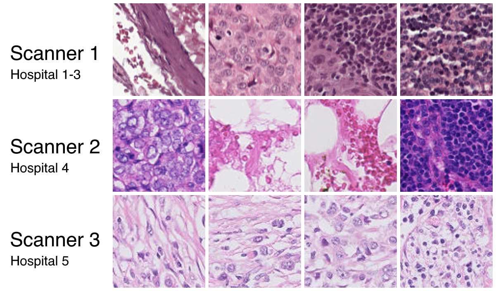
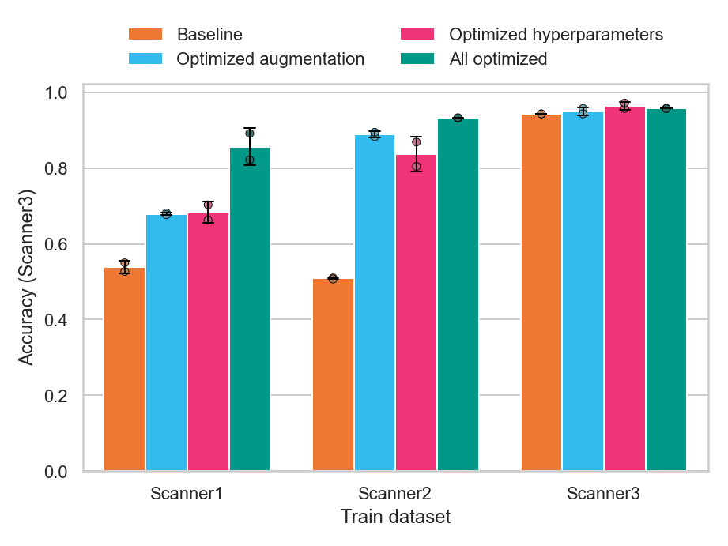

# Code for "Towards Generalizable Image Classification Models for Detecting Middle Ear Diseases"

This repo contains the code that was used to produce the results in the article "Towards Generalizable Image Classification Models for Detecting Middle Ear Diseases". Since we can't share the datasets used for the study, we have created a demo using another public dataset to benchmark generalizability with domain shift. This also shows the (meta-) generalizability of the methods on a separate medical diagnostic task that was not at any point used in the development of the methods.

# Demo on CAMELYON17

Run the file `run_demo.py` to test the code, and see the results of model generalizabiltity when training and testing on the CAMELYON dataset which is a benchmark for domain shift. The training code is written for use with a Nvidia GPU with at least 16 GB vram. Running this example will take around 6 hours with a decent CPU and GPU (a quicker example would not show the results as clearly, but it can be done by editing the experiment definition).

This image shows the variation between the three CAMELYON17 datasets:



When the training is finished the results are saved to the `statistics` folder, including a plot that shows the accuracy on the "Scanner 3" dataset for a model trained on either of the three datasets individually. The plot should look like this:



To train with your own datasets you only need to edit the paths and specify the experiment setup in the `experiment_definitions.py` file. The existing definitions represent the experimental setups used in the article. The data should be in a format to be used with [Torchvision ImageFolder](https://pytorch.org/vision/main/generated/torchvision.datasets.ImageFolder.html), and further split into train/test/validation folders:

```
dataset_root/dataset_1/train/<images>
dataset_root/dataset_1/validation/<images>
dataset_root/dataset_1/test/<images>

dataset_root/dataset_2/train/<images>
dataset_root/dataset_2/validation/<images>
dataset_root/dataset_2/test/<images>
```

# Installation: Python environment setup

Any recent version of Pytorch should work. Torcheval is also required. An anaconda environment with every requirement can be created with the following commands:

```
conda create -n generalizability python=3.10 pytorch=2.3 torchvision numpy seaborn pytorch-cuda=11.8 -c pytorch -c nvidia -c conda-forge -y

conda activate generalizability

pip install torcheval==0.0.7
```

Tensorboard logging is optional and can be activated by modifying `train.py`
